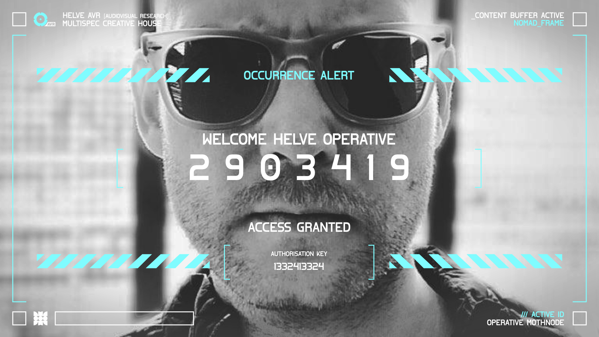
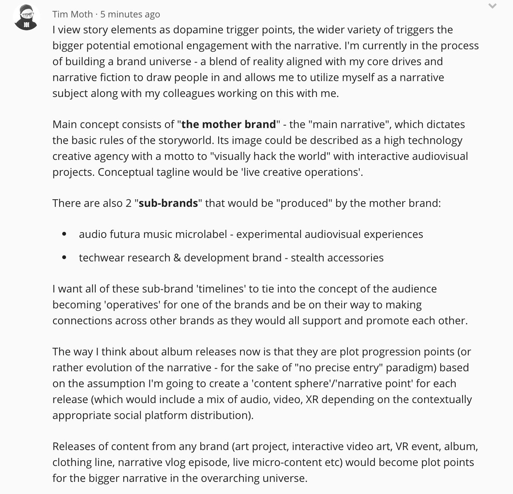
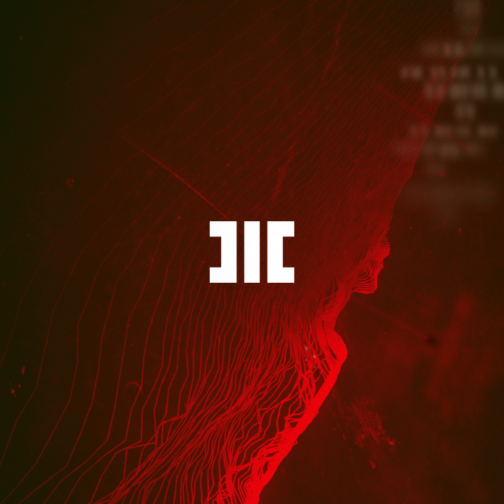
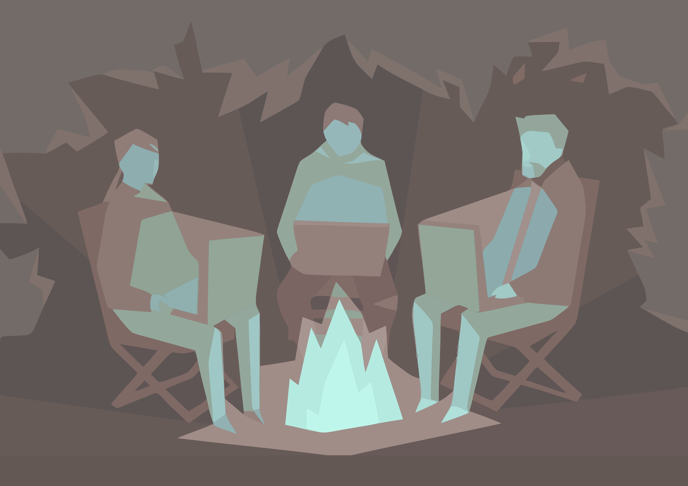

<a name="orientation"></a>
# HELVE ᴀᴠʀ | Rogue Creative Agency  

```
Etymological meaning of the word *helve* constitutes "a handle of a tool or a weapon".
```

---
> "Change Reality" / "Visually hack the world"

> "Agents of S.H.I.E.L.D. of Creative Industry"

> "Art + Creative Technology + Business + Education/Self-improvement"

> "It is a war between monotony and novelty, between stasis and creativity and in this war our human side for once is not destined to lose. - David Deutsch

> I work for my employees to ensure they can keep fulfilling their personal core drives.
---

REWORK THE INTRO

**HELVE ᴀᴠʀ** is a 2-12 years in the making creative meta entity/manifestation (or hyperbrand/metabrand), which has been my way to clarify who I am as a maker, as a human and what I strive for in life. Helve consists of Operatives who are a multispecialized group of acquainted creatives (world summoners, designers, videographers, musicians, game makers, writers) experimenting with advanced technology and creating new ways of expression in various tech and content outputs. 

As an independent creative taskforce we operate between the borders of creative industries and freedom of conceptual anarchy. Analyzed experimentation is our preferred approach to problems and a form of expression alike. 

The reason Helve ᴀᴠʀ exists is to create not only new ways of expression for us as artists and crafters but also to provide new future environments and ways of communication both in real life and in mixed reality experiences. Our core drive is to **visually hack the world** and promote being creative and proactive with one's life through documenting the process of making something and potentially inspiring others to make their own unusual creative projects - be it a big or small story to tell.

As a service Helve ᴀᴠʀ aims to provide a variety of expertise from video and live production, through design of transmedia narrative engagement of the audience to interactive audiovisual installations for brands and dark moon brand creation itself (*brands inherently rebellious in nature, trying to change the status quo, with preference for persistent small experimental steps and the philosophy that quantity creates quality* - read more about [Helve ᴀᴠʀ Agency Source Code](#sourcecode) below).

Our entity uses Reinforced Trisight methodology - we base our live creative operations within 3 fields of creativity: Audio, Visual & Research/Interaction. Such specific division works in conjunction with a 'life purpose' project initially created for personal use called [Dopamine Trails](https://github.com/HELVE/DOPAMINETRAILS) (function: clarifying ones core drives, discovering strengths and weaknesses, optimizing lifestyle for creativity) and is what makes the foundation for Helve ᴀᴠʀ's operational values. 

**Simple Helve AVR ops description:** The base for it would be like this: Helve AVR is supposed to exist both in reality as a real service business providing visual tech but also in a semi-ficticious reality where I want to make content from creating a „special op” where my team will go on a rogue visual hacking of the world (going somewhere, setting up projections to completely change the environment) and showing the main drive of the agency to „visually hack the world”. Helve AVR is intended to have much less lore than Hitech Crime as it should be grounded in reality while HC is a pure fiction and written content.

## Helve Operative Guidelines - Directive Protocols

Directive Protocols act as a basis for behavioral priorities and are a direct reflection of the values that creatives of Helve try to uplift for the sake of personal development and growth. Every Helve Operative in the field initiates and fulfills the protocols as needed or required after a self-realization session. 

Directive Protocols | Type [Lifeloop] | Notes
------------ | ------------- | -------------
1 **Alpha [α]** | **[Survival]** | **Initiate recovery mode.** <br> Self-preservation is essential. Take care of your physical and mental health as well as finances.
2 **Beta [β]** | **[Knowledge]** | **Initiate clarity mode.** <br> Trust your intuition but reinforce it with learning, tracking and organization. 
3 **Gamma (Γ)** | **[Creativity]** | **Initiate grind mode.** <br> Mission comes first. Relentlessly create things you love.
4 Delta (Δ) | [Communication] | **Initiate direct mode.** <br> When in contact with others pass The Three Gates of Speech (truth, necessity, kindness). Enforce them when possible.
5 Epsilon (ε) | [Attachment] | **Initiate optimal social variable mode.** <br> Reasses your attachments, don't take or create a life. Create emotional tension only through creativity.
6 Omega (Ω) | [Reset] | **Initiate wipe and burn mode.** <br> In case of mission failure reassess and readapt before starting anew. Take in everything you learned on the way.

## Agency Source Code

* DIVE INTO THE CHAOS, COME OUT ENLIGHTENED.
* ENDLESSLY OPTIMIZE ENLIGHTENMENT INTO ORDER.
* FALL IN LOVE WITH THE PROCESS.
* DON'T TALK, EXECUTE.
* MOBILE AND GLOBAL AVAILABILITY FIRST.
* BE EVERYWHERE WHERE IT COUNTS.
* RELEVANCE OVER REACH.
* PROVIDE DOPAMINE TRIGGERS TO YOUR AUDIENCE [VALUE].
* GIVE EVERYTHING AWAY FOR FREE.
* NEVER ENOUGH CONTENT.
* QUANTITY CREATES QUALITY.
* ESTABLISH MEMETIC "DEPENDENCE".
* "CONTROL" THE DOPAMINE AND YOU "CONTROL" THE WORLD.

---

# Helve ᴀᴠʀ Creative Universe Approach

Helve ᴀᴠʀ as a hyperbrand exisiting both in reality and in the narrative universes has several own dark moon brands developed under its wings. Each of the metabrands represents a range of underlying emotions/motivations/mindstates related to the main core drive of the agency, which is to vishack the world. 

All metabrands are implemented through creation of specific narrative transmedia universes. They are often based on an episodic/seasonal structure as well as rapid prototyping and behind the scenes approach ([Helve Logs - Live Documentation Series](https://github.com/HELVE/HELVELOGS)).

What humans value the most is escapism and convenience. Helve AVR intends to give you a carefully designed mix of these in order to provide you with inspiration as well as something to identify with. Once a person identifies with the escapism of the universes Helve intends to provide you with mental and physical "weapons"/products/tools that enable one to grow. Hit them with escapism to draw them in, then promote and stimulate productive and positive behaviours.

*note: suck users in with escapism, keep them with providing value (they didin't expect?)* surprise factor? word of mouth for people who can't see through the metanarrative?

Note: It is easy to create content when you are living the content. The truth costs you nothing, the lies mean effort. Show your truth. "Devalue the production quality, upvalue the output."

Thank you so much for responding Neon, to make it as approachable as a concept as possible I am gathering like-minded individuals who would like to work on big scale art projects of visually hacking the world using creative tech. As a collective making our own public displays of augmented art, changing the reality in a way (it will start with small area rogue activities to temporary shift the enviros as a kind of semi-ficticious performance having effects IRL and livestream the activities/operations across various „cells” - haha - in a way that creates human anticipation and gives a fresh factor of unknown - nobody will know where and when but we will give hints as to upcoming „events”). To be more precise: establish the concept of mixed augmented visuals  for whole city segments and make an efficient mobile tech that will enable operatives to easily create the art on the spot as well, seemingly „hostile art takeover” as events to gain recognition and make the world an exhibition space.



## Quick Rephrasing

> 

<a name="divisions"></a>
## Agency Metabrands

### Helve AVR
#### 'Motherbrand' Audiovisual Hacking Division

The overarching hyperbrand/metabrand. Crossing between reality, inspiration and fiction.

**Personal Core Drive:** change the environment we live in on a large scale through artistic expression.

- leave a mark on the world
- make large scale creative technology interactive projects
- establish a safe space to experiment either solo or in a team

MY PURPOSE AS A PERSON_
- Self-expression / Creativity
- Enabling people to figure out and express their true selves
- Gather likeminded people so they thrive together >>> difference in polarity of purpose to achieve balance between personal and metabrand purpose

MY PURPOSE AS METABRANDS_
- Helve AVR: build a foundation to explore and experiment with new ways of communication and expression
- Hitech Crime: educate via entertainment as a hook how to transform negativity into a positive drive for growth
- Kannibal: give people ability to be separate/hidden >>> difference in polarity of purpose to achieve balance between personal and metabrand purpose

> Transmedia Experience Division

> Future Tracing Division

> Interactive Community Entertainment Division

Alternative segmentation via AVR:

- Audio Division

- Visual Division

- Research Division

### [Hitech Crime Metabrand](https://github.com/HITECHCRIME/HC_OVERVIEW)
#### **Transmedia Experience Division [ACTIVE PROTOTYPING PHASE]**

> Audio Futura Microlabel Universe
> Narrative Audiovisual Universe <- too broad



**Personal Core Drive:** Make a contained narrative world for personal "bad programs".

- each album release is a chapter of the story that can be experienced in multitude of ways through many platforms
- leave a mark on the world, take your future into your hands
- express your emotions in order to contain them and use them (main lesson for the audience)
- have an audio microlabel with the most unique lore
- create a transmedia universe that people can experience and interact with in any way they want

[HITECH CRIME OVERVIEW](https://github.com/HITECHCRIME/HC_OVERVIEW).

### [Kannibal Wear Metabrand](https://github.com/KANNIBALWEAR/K_OVERVIEW)
#### Future Tracing Division [ACTIVE RESEARCH PHASE]**

> Stealth Techwear R&D - Clothing & Accessories. 


**Personal Core Drive:** lead a trace into the future. Promote experimental mindset.

- express your need for survival
- express your need for being separate/stealth
- have a future-facing (luxurious) minimal stealth techwear brand

[KANNIBAL WEAR OVERVIEW](https://github.com/KANNIBALWEAR/K_OVERVIEW)

### Cyberhippie Metabrand 
#### Interactive Community Entertainment Division** [INACTIVE/DORMANT PHASE]



> Cyberhippie Collective started out as an online Discord server gathering 100+ game developers and gamers from various parts of the globe. After a tumultuous period of pivoting, as an obviously conscious entity it finally settled on being a coworking space for creative technology ethusiasts.

**Personal Core Drive:** facilitate learning creative technology and game development.

- express your need for community
- enable people to work and be creative together
- have the best coworking office for creative technology enthusiasts

[INACTIVE PATREON](http://www.patreon.com/cyberhippie)

<a name="team"></a>
## Helve ᴀᴠʀ Operatives
[Helve Global Creative Operations Map](https://www.google.com/maps/d/edit?mid=1Qrx0NeEIWzPDpKbW6wnGU3gymHyP_N3H&ll=5.384339976371358%2C0&z=2): 

+ mothnode        (Moth) / Tim Moth (Poland/Nomad)        / ACTIVE
+ Sara Mora       (Mora) / Sara Morawska (Poland/Iceland) / RETHINK, NON-RESPONSIVE, NOPE
+ Mechanoreceptor (Mech) / Ryan Northcott (US/Austin)     / DORMANT
+ Jac             (Jhas) / Jacinto Quesnel                / DORMANT
+ potential additional operatives will be chosen based on a specific set of requirements (Helve Orientation programme)

## Potential Agency Skillpaths/Project Types

- Transmedia Narrative Design & Production
- Video Production & Editing
- Video Art Installations
- Livestream Production
- Interactive VJing
- Dark Moon Brand Consulting
- Marketing for Artists and Creators
- Photogrammetry
- Advanced Stock Video/Photo Creation
- Software Development
- XR Experiences Production & Deployment
- Experimental Research Projects
- Livecoding
- Augmented & Mixed Reality Custom Projects
- Voice Ops - creative voice projects ([Skillpath.ai Entity](https://github.com/HELVE/SKILLPATH.AI))
